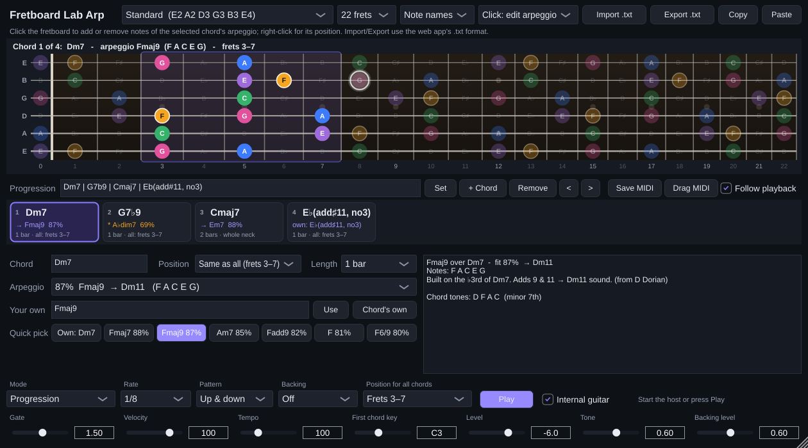

# Fretboard Lab Arp — VST3 / AU plugin 🎸

A guitar-arpeggio instrument for your DAW, built on the music-theory engine of the Fretboard Lab web
app. Type (or import) a chord progression, choose an arpeggio for every chord on a clickable
fretboard, and the plugin plays the arpeggios as a guitar line in sync with your song — with its own
plucked-string sound and as MIDI for any other instrument.

Formats: **VST3** (Windows, macOS, Linux), **AU** (macOS) and a **standalone app**.



## What it does

- **Clickable fretboard** — every note is labelled; the selected chord's arpeggio is coloured by
  degree (root, 3rd, 5th, 7th, tensions) and its playing position is shaded. The note being played
  lights up. Works in every tuning of the web app (standard, drop D/C/B/A, open tunings, 7- and
  8-string, baritone, bass…), 22 or 24 frets.
  - **Click** a note to add it to — or remove it from — the chord's arpeggio. The notes are
    recognised and rated like in the web app (`E G B D` over `Cmaj7` → *Em7, fit 88 %, → Cmaj9*).
  - **Shift-click**, or switch to *Click: just play*, to use the fretboard as an instrument.
  - **Right-click** to set the position: this chord in frets 5–9, the whole neck, or the same
    position for all chords.
- **Arpeggios for every chord** — the chord's own arpeggio, **20 suggestions ranked by fit %**
  (the same list and percentages as the web app: Fmaj9 over Dm7 → Dm11, A♭dim7 over G7 → G7♭9…),
  a *Quick pick* row with the best ones, or **type your own** — a chord symbol (`Bbmaj7`, `F#m7b5`,
  `Eb(add#11,no3)`) or just notes (`E G B D`).
- **Per-chord position and length** (1 beat … 4 bars), and a shared position for all chords.
- **Import / Export** in exactly the web app's `.txt` format — export in the browser, import in the
  plugin and back. *Copy* / *Paste* go through the clipboard, and a `.txt` file can be dropped on the
  window. The progression is also saved with your DAW project.
- **MIDI file** — *Save MIDI* writes the whole progression's arpeggios (track 1, channel 1) and
  backing (track 2, channel 2) as a `.mid` file; **drag the *Drag MIDI* button onto a DAW track**
  to drop the part straight into your song and edit it there.
- **Playback**
  - *Progression* mode follows the host's transport (bar 1 = chord 1, the progression loops), or
    press **Play** to use the plugin's own clock.
  - *Keys pick chord*: MIDI keys from *First chord key* (C3 by default) upwards play chord 1, 2, 3…
    for as long as they are held — play the changes live or from a MIDI clip.
  - *Keys play notes*: hold any notes and they are played as a guitar arpeggio, in the position of
    the selected chord (the fretboard names the chord you hold).
  - Rate (1/4 … 1/32, triplets), pattern (voice-led like the web app, up, down, up & down, random),
    gate, velocity, optional strummed **backing** chord + bass.
- **Sound and MIDI** — a built-in plucked-string (Karplus–Strong) guitar with level and tone, and
  MIDI out: arpeggio on **channel 1**, backing on **channel 2**. Turn *Internal guitar* off to drive
  another instrument only. (Hosts that route MIDI from instrument plugins — e.g. Reaper, FL Studio,
  Bitwig — can feed it to any other instrument; Ableton Live does not route MIDI out of VST3
  instruments, so use the internal sound there.)

## Install

Download the zip for your system from the **Plugin** workflow run on GitHub (*Actions → Plugin →
latest run → Artifacts*: `FretboardLabArp-Windows`, `-macOS`, `-Linux`), unzip it and copy:

| System | VST3 | Other |
|---|---|---|
| Windows | `Fretboard Lab Arp.vst3` → `C:\Program Files\Common Files\VST3\` | `Fretboard Lab Arp.exe` = standalone app |
| macOS | `Fretboard Lab Arp.vst3` → `~/Library/Audio/Plug-Ins/VST3/` | `.component` → `~/Library/Audio/Plug-Ins/Components/` (AU); `.app` = standalone |
| Linux | `Fretboard Lab Arp.vst3` → `~/.vst3/` | `Fretboard Lab Arp` = standalone app |

Then rescan plugins in your DAW and add **Fretboard Lab Arp** as an *instrument*.

The builds are not signed with a paid certificate: on Windows SmartScreen may ask to confirm the
standalone app; on macOS run `xattr -cr ~/Library/Audio/Plug-Ins/VST3/"Fretboard Lab Arp.vst3"`
(and the same for the `.component` / `.app`) once if the system refuses to open it.

## Using it with the web app

1. Build a progression in the web app's *Progression builder* and pick arpeggios, positions and
   lengths in *Arpeggios through the changes*.
2. Click **Export .txt** (or *Copy*).
3. In the plugin click **Import .txt** (or *Paste*, or drop the file on the window). The chords,
   arpeggios, positions, lengths, tempo and tuning come across.
4. Edit in the plugin, then **Export .txt** — the web app's *Import* reads it back.

The plugin's chord names and arpeggio ratings come from a C++ port of the web app's engine
(`Source/core`), checked against the web app on more than 50,000 cases (every set of notes with
every bass note, chord-symbol parsing, the suggestion lists and their fit %), so both always agree.

## Parameters (automatable)

| Parameter | |
|---|---|
| Mode | Progression · Keys pick chord · Keys play notes |
| Rate | 1/4, 1/8, 1/8 triplet, 1/16, 1/16 triplet, 1/32 |
| Pattern | Voice-led, Up, Down, Up & down, Random |
| Gate | note length as a fraction of a step (> 1 lets notes ring) |
| Velocity | MIDI velocity (accents on the beat are added) |
| Backing | Off · Chord · Chord + bass (MIDI channel 2) |
| Internal guitar, Level, Tone, Backing level | the built-in sound |
| Tempo | the plugin's own clock (the host tempo is used while the host plays) |
| First chord key | lowest key of *Keys pick chord* |

## Building from source

Requires CMake 3.22+ and a C++17 compiler (Visual Studio 2022, Xcode 15, GCC 11+ or Clang 14+).
JUCE 8 is downloaded automatically.

```bash
cmake -S plugin -B plugin/build -DCMAKE_BUILD_TYPE=Release
cmake --build plugin/build --config Release
ctest --test-dir plugin/build -C Release          # C++ core vs. the web app's results
plugin/build/fl_engine_tests_artefacts/Release/fl_engine_tests   # processor end-to-end tests
```

On Linux install JUCE's dependencies first (`libasound2-dev libfreetype6-dev libfontconfig1-dev
libx11-dev libxcomposite-dev libxcursor-dev libxext-dev libxinerama-dev libxrandr-dev
libxrender-dev libgl1-mesa-dev`). The built plugins are in
`plugin/build/FretboardLabArp_artefacts/Release/`.

After changing the web app's chord dictionary, scales or tunings run `npm run gen:plugin`: it
regenerates `Source/core/GeneratedTables.inc` and the test vectors `tests/vectors.txt` from the
TypeScript engine (CI checks that they are up to date).

```
plugin/
  Source/core/         C++17 port of the web app's theory engine (no JUCE): Theory (notes, chord
                       dictionary, parsing, identification, generic names), Arpeggios (own +
                       ranked suggestions), Fretboard (positions, voice-led lines), Arrangement
                       (the .txt format), Song (the plugin's document and the phrase it plays)
  Source/              JUCE plugin: PluginProcessor (sequencer, MIDI, state), GuitarSynth,
                       PluginEditor, FretboardView, ChordStrip, Theme
  tests/CoreTests.cpp  core tests + comparison with tests/vectors.txt (generated by the web app)
  tests/EngineTests.cpp  end-to-end tests of the processor, editor snapshots
```

JUCE is used under the terms of the AGPLv3 (or a commercial JUCE licence).
